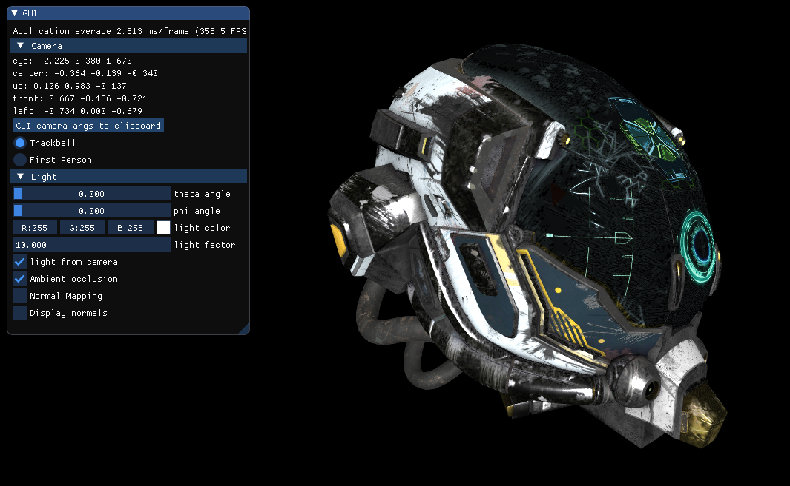
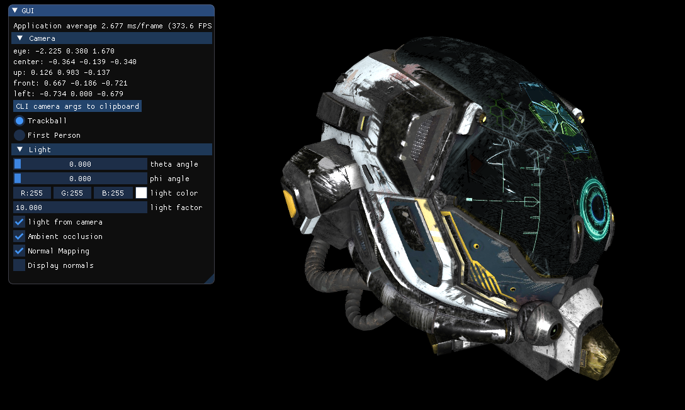
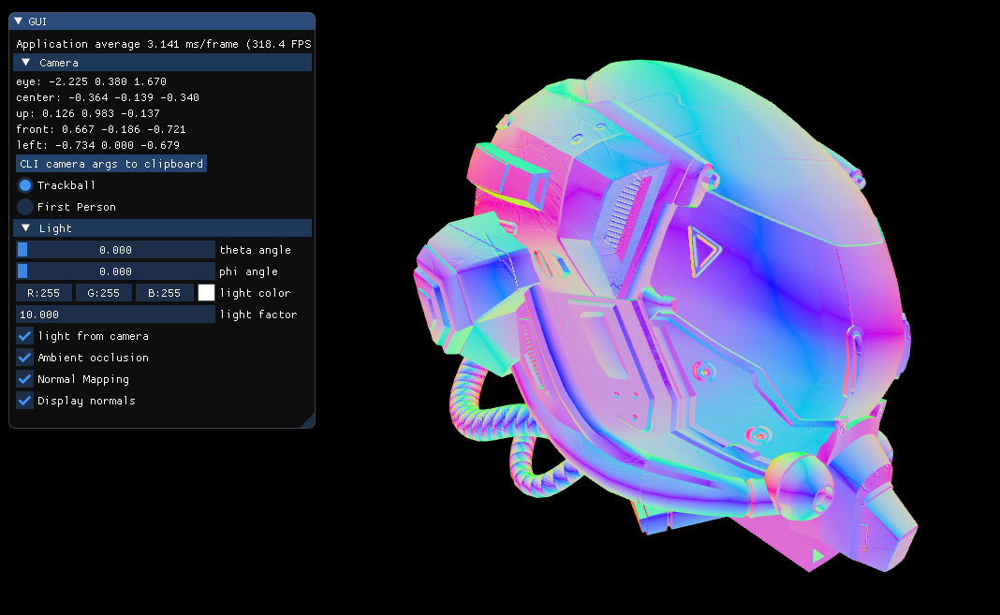
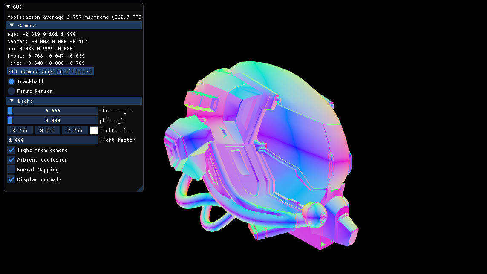

# Rapport du projet de Synthèse d'Image Avancée - Thomas Dumont

## Choix du sujet : Normal Mapping

Pour ce projet j'ai décidé de partir sur le normal mapping. Vous pourrez donc trouver sur le viewer les 2 checkbox suivantes :
- Normal Mapping : cela va tout simplement appliquer le normal mapping sur objet, si ce dernier ne possède pas de normal texture, cela ne changera rien de l'activer ou non.
- Display Normals : Si la checkbox Normal Mapping, cela remplacera le rendu des textures de l'objet par le rendu des normals, Si Normal Mapping est décoché ou bien si le modèle ne possède de normal texture cela affiche les normals de base.

### Rendu sans normals

### Rendu avec normals

### Affichage des normals uniquement avec normal mapping

### Affichage des normals uniquement sans normal mapping

## Difficultés rencontrées

De manière globale, le projet était d'une difficulté moyenne. J'ai principalement eu des difficultés quant à la récupération des positions et coordonnées de texture pour le calcul des tangents bitangents.

Tout d'abord, je n'avais compris tout de suite ce qu'il fallait réutiliser de la fonction `computeSceneBounds` du fichier `utils/gltf.cpp`.

Afin d'éviter de dupliquer les données stockées pour les positions et textcoords, j'ai modifié ma fonction calculant les (bi)tangents pour utiliser les index et récupérer directement des pointers vers ses données. Rien de compliquer ici, cependant, j'ai mis du temps à comprendre que les tableaux contenaient les informations pour l'ensemble des meshes du modèle. Je me retrouvais donc à dire au shader pour chaque meshe qu'il faut qu'il utilise un nombre exorbitant de (bi)tangents, ce qui avait créé un gros souci de performance avec sponza. Problème qui a été reglé en calculant le nombre de (bi)tangents par meshes.

## Connaissances acquises en implémentant les features

Initialement, je n'avais qu'une connaissance très globale de ce qu'était une normal dans le domaine de la 3D. Après ce projet j'ai compris à quel point cela peut être pratique.
Pouvoir apporter des détails, certes minimes, mais qui auraient été fortement complexe et énergivores lors de la modélisation via une simple texture est un avantage considérable. Ayant pour vocation  de travailler dans ce domaine, savoir recalculer des normals est une connaissance, à mon ses, assez essentielle.

## Bonus

J'ai déjà préparer quelques modèle directement dans le `bash-init.sh` pour pouvoir tester le normal mapping sur des objets autre que sponza ou damagedHelmet. Voici la liste des objets que vous pouvez tester:

- view_helmet
- view_sponza
- view_suzanne
- view_boom_box
- view_scifi_helmet
- view_lantern
- view_toy_car